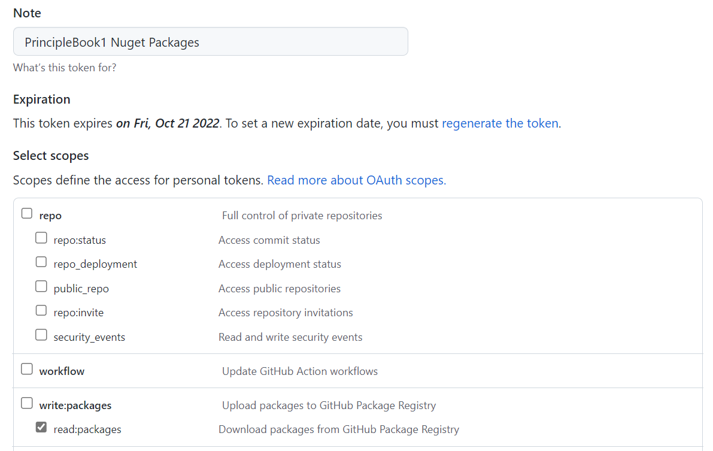

# Testing NuGet packages built by GitHub Actions

1. Set up a GitHub personal access token.

    In GitHub, go to your Settings (under your profile icon), find the Developer Settings section, and open the Personal Access Tokens section. Click "Generate a new token" and configure it with the following settings. (The Note may be whatever you want to remember what it was for; I usually name it for the computer and purpose the key was for so it is easy to delete/revoke later.)

    

    Save the generated key after saving - at least through step 2. (You may regenerate it if you lose it.)

2. Create a file called `NuGet.config` either at or above your project structure on your file system. (I would recommend putting it above your git directory so you do not check it in!) In it, put the following contents, replacing `--your-key--` with the key from step 1:

        <?xml version="1.0" encoding="utf-8"?>
        <configuration>
          <packageSources>
            <add key="github-ps" value="https://nuget.pkg.github.com/PrincipleStudios/index.json" />
          </packageSources>
          <packageSourceCredentials>
            <github-ps>
                <add key="Username" value="mdekrey" />
                <add key="ClearTextPassword" value="--your-key--" />
              </github-ps>
          </packageSourceCredentials>
        </configuration>

3. Update your project file to reference the versions from GitHub. The version will be what the released version number will be, but with a suffix indicating a prerelease including the sha of the hash that was used to build the code. (See [PrincipleStudios.OpenApiCodegen.Server.Mvc](https://github.com/PrincipleStudios/principle-studios-openapi-generators/packages/1228089) for example.)

        <PackageReference Include="PrincipleStudios.OpenApiCodegen.Server.Mvc" Version="--version-number--" PrivateAssets="All" />

4. Restore your project. If you've done everything correctly, it should build using the test version of the package!
